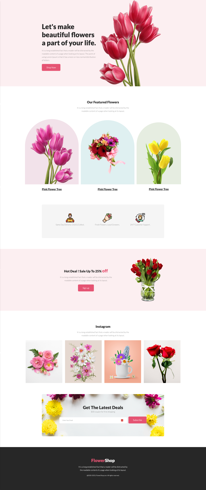

# flower-shop-assignment - Programming Hero

## Learing Objects

In the process of creating a website using HTML5 and the latest CSS3 features, I embarked on an exciting journey of technological exploration and creativity. The experience not only empowered me with fundamental web development skills but also introduced me to the cutting-edge capabilities that HTML5 and CSS3 bring to the digital realm.

 

With HTML5, I discovered a more streamlined way of structuring content, leveraging its semantic elements to provide meaningful context to each section. The integration of multimedia elements, such as video and audio, enriched the user experience and demonstrated the modern web's dynamic nature.

 

Incorporating CSS3 into my project allowed me to style and design with unprecedented finesse. I harnessed the power of responsive design, ensuring my website adapts gracefully to various screen sizes. CSS3 transitions and animations breathed life into my interface, creating engaging interactions that captivated visitors.

 

Throughout this project, I learned the importance of clean code and efficient design principles. I realized that a strong foundation in HTML5 and CSS3 is essential for constructing visually appealing, functional, and accessible websites. As I continue to explore and refine my skills, I'm excited to delve deeper into the possibilities offered by these technologies, constantly evolving my abilities to craft remarkable web experiences.

## Here is the output layout

## Live Link <a href="https://the-mihir.github.io/flower-shop-assignment/"> Clik Here to see the Live page </a>
